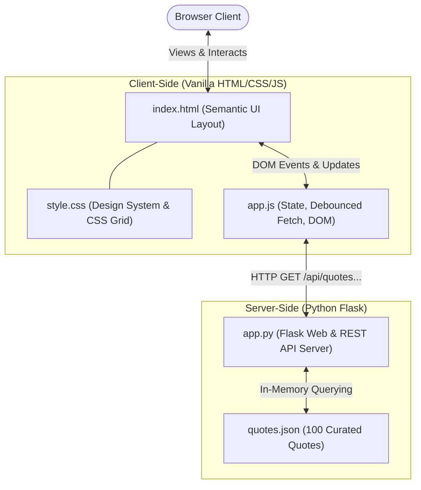

<div align="center">

# ❝ Wisdom Deck
### 100 Timeless Quotes &bull; Full-Text Search &bull; Flask & Vanilla JS

[](https://python.org)
[](https://flask.palletsprojects.com/)
[](https://docs.astral.sh/uv/)
[](tests/test_app.py)
[](#license)

A responsive, lightweight web application showcasing 100 well-known, historically curated quotes across Science, Philosophy, Technology, Literature, Leadership, Art, and Wisdom.

[Features](#-key-features) • [Quickstart](#-quickstart) • [Architecture](#-architecture) • [API Reference](#-api-reference) • [Testing](#-running-tests)

</div>

---

## ✨ Key Features

* **🎲 Hero "Quote of the Moment"**:
  * Automatically serves an inspiring random quote upon page load.
  * Instant **"Roll New Quote"** generator with smooth fade transitions.
  * Optional category selector to target random rolls to a specific field.
  * One-click **"Copy Quote"** button formatted with author attribution and toast feedback.

* **🔍 Real-Time Search & Multi-Filter**:
  * **Debounced instant search** (250ms delay) across quote text, author names, and categories without page reloads.
  * **Category dropdown & chip pills** to filter by Science, Philosophy, Technology, Literature, Leadership, Art, or Wisdom.
  * **Author dropdown** with dynamic counts of quotes per author.
  * Dynamic result counter (`Showing X of 100 quotes`) and one-click filter reset.

* **🎴 Interactive Quotes Catalog**:
  * Responsive CSS Grid of cards displaying every quote with category-specific color badges.
  * Click any author or category tag on a card to instantly drill down into related quotes.
  * Individual copy button on each card with animated toast alerts.

* **⚡ Zero-Bloat Frontend**:
  * Crafted in plain vanilla HTML5, CSS3, and modern JavaScript (Async/Await, Fetch API, DOM API).
  * No npm build steps, webpack, or frontend framework overhead.
  * System-adaptive dark aesthetic styled with Google Fonts (*Cinzel*, *Lora*, *Inter*).

* **🚀 Modern Python Tooling**:
  * Built on Python Flask and managed via Astral's blazingly fast **`uv`** package manager.

---

## 🏗 Architecture



---

## 📁 Directory Structure

```
famous-quotes/
├── app.py                   # Flask server and REST API endpoints
├── quotes.json              # Curated database of 100 famous quotes
├── pyproject.toml           # Project dependencies and pytest configuration
├── uv.lock                  # Pinned dependency lockfile
├── .python-version          # Active Python version specification
├── .gitignore               # Comprehensive ignores (venv, cache, macOS, IDEs)
├── README.md                # Project documentation
│
├── templates/
│   └── index.html           # Single-page application HTML template
│
├── static/
│   ├── css/
│   │   └── style.css        # Responsive CSS styling, variables, theme, cards
│   └── js/
│       └── app.js           # Client application logic, search debounce, fetch calls
│
├── tests/
│   └── test_app.py          # Pytest suite covering endpoints, filters, dataset
│
├── src/
│   └── famous_quotes/       # Python package entrypoint
│       └── __init__.py
│
└── artifacts/               # Implementation plan and walkthrough records
    ├── plan.md
    └── walkthrough.md
```

---

## 🚀 Quickstart

### Prerequisites

- [uv](https://docs.astral.sh/uv/) installed:
  ```bash
  # macOS (via Homebrew)
  brew install uv

  # Linux / macOS (via curl)
  curl -LsSf https://astral.sh/uv/install.sh | sh
  ```

### 1. Clone the Repository
```bash
git clone https://github.com/JohanMontesinos/amazing-famous-quotes.git
cd amazing-famous-quotes
```

### 2. Run the Application with `uv`
Dependencies are automatically synced and cached by `uv`:

```bash
uv run python app.py
```

Or run via the Flask development CLI:
```bash
uv run flask --app app run --port 5000
```

### 3. Open in Browser
Visit **[http://127.0.0.1:5000](http://127.0.0.1:5000)** in your browser.

> *(Alternative without uv: You can also use standard Python `python3 -m venv .venv && source .venv/bin/activate && pip install flask pytest`)*

---

## 🔌 API Reference

### 1. `GET /api/quotes/random`
Returns a single random quote.

* **Optional Query Parameters**:
  * `category` *(string)*: Filter random selection by category name (e.g. `Science`).
  * `author` *(string)*: Filter random selection by author name (e.g. `Turing`).

* **Response (`200 OK`)**:
  ```json
  {
    "id": 1,
    "quote": "A computer would deserve to be called intelligent if it could deceive a human into believing that it was human.",
    "author": "Alan Turing",
    "category": "Technology"
  }
  ```

---

### 2. `GET /api/quotes`
Query and filter quotes from the dataset.

* **Optional Query Parameters**:
  * `q` *(string)*: Free-text keyword search across quote body, author, and category.
  * `category` *(string)*: Exact category match (e.g. `Philosophy`).
  * `author` *(string)*: Case-insensitive substring match (e.g. `Einstein`).

* **Response (`200 OK`)**:
  ```json
  {
    "total": 4,
    "quotes": [
      {
        "id": 2,
        "quote": "Two things are infinite: the universe and human stupidity; and I'm not sure about the universe.",
        "author": "Albert Einstein",
        "category": "Science"
      }
    ]
  }
  ```

---

### 3. `GET /api/categories`
Returns all unique categories sorted alphabetically with quote counts.

* **Response (`200 OK`)**:
  ```json
  [
    { "name": "Art", "count": 6 },
    { "name": "Leadership", "count": 14 },
    { "name": "Literature", "count": 14 },
    { "name": "Philosophy", "count": 15 },
    { "name": "Science", "count": 14 },
    { "name": "Technology", "count": 14 },
    { "name": "Wisdom", "count": 23 }
  ]
  ```

---

### 4. `GET /api/authors`
Returns all unique authors sorted alphabetically with quote counts.

* **Response (`200 OK`)**:
  ```json
  [
    { "name": "Abraham Lincoln", "count": 2 },
    { "name": "Ada Lovelace", "count": 1 },
    { "name": "Alan Kay", "count": 1 },
    { "name": "Alan Turing", "count": 2 },
    { "name": "Albert Einstein", "count": 4 }
  ]
  ```

---

## 🧪 Running Tests

The test suite in [`tests/test_app.py`](tests/test_app.py) verifies:
- Exactly 100 well-formed quotes with unique IDs `1–100` and non-empty attributes.
- Home route HTML delivery.
- Random quote endpoint behavior (including category filters and 404 responses).
- Substring, author, and category catalog search matching.
- Aggregation endpoints for categories and authors.

To execute all tests with `uv`:

```bash
uv run pytest -v
```

```
============================= test session starts ==============================
collected 11 items

tests/test_app.py::test_quotes_file_contains_exact_100_valid_quotes PASSED [  9%]
tests/test_app.py::test_index_page PASSED                                [ 18%]
tests/test_app.py::test_random_quote_endpoint PASSED                     [ 27%]
tests/test_app.py::test_random_quote_with_category_filter PASSED         [ 36%]
tests/test_app.py::test_random_quote_nonexistent_category PASSED         [ 45%]
tests/test_app.py::test_get_all_quotes PASSED                            [ 54%]
tests/test_app.py::test_search_quotes_by_query PASSED                    [ 63%]
tests/test_app.py::test_search_quotes_by_author PASSED                   [ 72%]
tests/test_app.py::test_search_quotes_by_category PASSED                 [ 81%]
tests/test_app.py::test_get_categories_endpoint PASSED                   [ 90%]
tests/test_app.py::test_get_authors_endpoint PASSED                      [100%]

============================== 11 passed in 0.05s ==============================
```

---

## 📄 License

This project is licensed under the [MIT License](LICENSE).
