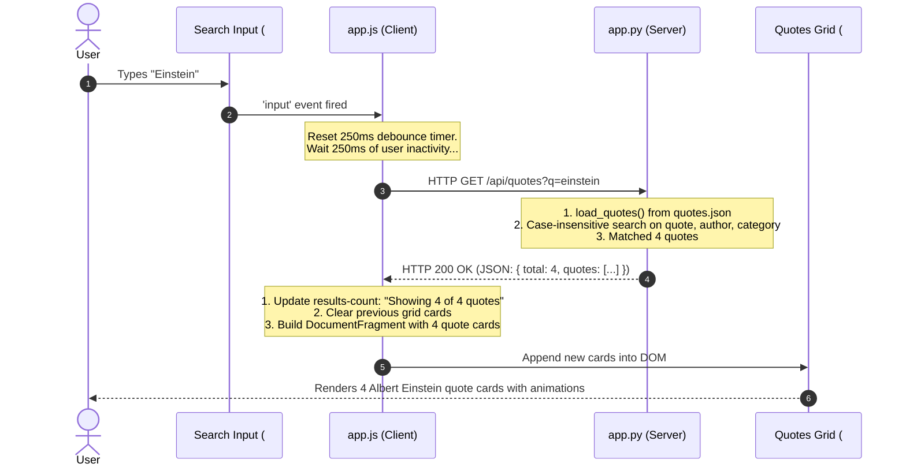

# Comprehensive Breakdown: Wisdom Deck (Famous Quotes) Application

This document provides a detailed architectural breakdown of the **Wisdom Deck (Famous Quotes)** application, explaining the core feature set, the separation of responsibilities between client and server, and an end-to-end trace of a sample request/response flow.

---

## 1. Main Features Overview

```
┌─────────────────────────────────────────────────────────────────────────────┐
│                              Wisdom Deck UI                                 │
├─────────────────────────────────────────────────────────────────────────────┤
│  [Hero] "Quote of the Moment"                                               │
│    • Displays a random quote on initial page load                           │
│    • [🎲 Roll New Quote] button (with optional category targeting)          │
│    • [📋 Copy] button to copy formatted quote & author to clipboard         │
├─────────────────────────────────────────────────────────────────────────────┤
│  [Search & Filter Toolbar]                                                  │
│    • Debounced real-time search (matches quote text, author, category)       │
│    • Filter dropdowns for Category and Author                               │
│    • Quick-toggle Category Chips ("All", "Science", "Philosophy", etc.)     │
│    • Dynamic result counter ("Showing X of 100 quotes")                     │
├─────────────────────────────────────────────────────────────────────────────┤
│  [Interactive Catalog Grid]                                                 │
│    • Displays matching quotes in responsive CSS Grid cards                  │
│    • Interactive tags: click an author or category to instantly filter      │
│    • One-click copy button per card with toast feedback                     │
└─────────────────────────────────────────────────────────────────────────────┘
```

* **100 Curated Quotes**: A diverse dataset across 7 domains: *Science*, *Philosophy*, *Technology*, *Literature*, *Leadership*, *Art*, and *Wisdom*.
* **Zero Client Build Step**: Uses standard Vanilla JavaScript (`fetch`, `async`/`await`, DOM APIs) and modern CSS with zero heavy frameworks or compilation overhead (no React, Vue, or Webpack).
* **High-Speed Python Backend**: Powered by Flask and managed with Astral's `uv` package manager.

---

## 2. Server-Side Architecture (Python / Flask)

The backend server is implemented in [`app.py`](../app.py) and reads from [`quotes.json`](../quotes.json).

### Core Responsibilities
1. **Static & HTML Delivery**: Serves the single-page application entry point (`/`) and static assets (`style.css`, `app.js`).
2. **REST API Data Provider**: Exposes JSON endpoints that read and filter the quote data.
3. **In-Memory Querying**: Performs fast substring and category matching on the dataset without requiring an external database.

### REST API Endpoints

| Endpoint | Method | Purpose | Key Query Parameters |
| :--- | :--- | :--- | :--- |
| `/` | `GET` | Renders `templates/index.html` | None |
| `/api/quotes/random` | `GET` | Returns 1 randomly selected quote object | `?category=...`, `?author=...` |
| `/api/quotes` | `GET` | Returns filtered quotes list & total count | `?q=...`, `?category=...`, `?author=...` |
| `/api/categories` | `GET` | Returns list of categories with quote counts | None |
| `/api/authors` | `GET` | Returns sorted list of authors with quote counts | None |

### In-Memory Filtering Logic
In `app.py`, queries are processed using Python list comprehensions:

```python
# 1. Exact Category Filter (Case-insensitive)
if category:
    results = [q for q in results if q["category"].lower() == category]

# 2. Author Substring Filter (Case-insensitive)
if author:
    results = [q for q in results if author in q["author"].lower()]

# 3. Free-Text Keyword Search across quote, author, or category
if query:
    results = [
        q for q in results
        if query in q["quote"].lower()
        or query in q["author"].lower()
        or query in q["category"].lower()
    ]
```

---

## 3. Client-Side Architecture (Vanilla HTML5 / CSS3 / JS)

The frontend is divided into three key files:
1. **`templates/index.html`**: Semantic layout containing the header badges, hero quote container, search toolbar, results grid, and toast notification modal.
2. **`static/css/style.css`**: Design system utilizing CSS Custom Properties (`--bg-main`, `--accent-primary`), category accent colors, and responsive CSS Grid breakpoints.
3. **`static/js/app.js`**: Application state management, event listeners, API fetch routines, and dynamic DOM rendering.

### State Management
The client maintains its state in a single centralized object:

```javascript
const state = {
  currentRandomQuote: null, // Currently displayed hero quote
  categories: [],           // Available categories with counts
  authors: [],              // Available authors with counts
  activeCategory: '',       // Active category filter string
  activeAuthor: '',         // Active author filter string
  searchQuery: '',          // Active text search string
  debounceTimer: null,      // Timer reference for input debouncing
};
```

### Key Frontend Mechanisms
* **Debounced Search**: Typing into `#search-input` resets a 250ms debounce timer before executing `fetchCatalogQuotes()`. This prevents unnecessary network requests during active keystrokes.
* **Efficient DOM Construction**: Uses `document.createDocumentFragment()` to construct all quote cards in memory before appending them to the DOM in a single paint operation.
* **Clipboard Copy API with Fallback**: Uses `navigator.clipboard.writeText()` when available in secure contexts, with an automatic fallback to an off-screen `textarea` for older or non-HTTPS environments.

---

## 4. End-to-End Sample Flow: Searching for "Einstein"

The following sequence illustrates the complete lifecycle when a user types `"Einstein"` into the search input.



### Detailed Trace

1. **User Action**: The user types `"Einstein"` into the search bar.
2. **Client-Side Debouncing**:
   - The browser emits an `input` event.
   - `app.js` clears any existing timer and schedules `fetchCatalogQuotes()` in 250ms.
3. **HTTP Request**:
   - `fetchCatalogQuotes()` calls `fetch('/api/quotes?q=Einstein')`.
   - Browser sends:
     ```http
     GET /api/quotes?q=Einstein HTTP/1.1
     Host: 127.0.0.1:5000
     Accept: application/json
     ```
4. **Server-Side Execution**:
   - Flask's `/api/quotes` handler parses `request.args.get("q")`.
   - Compares the lowercased query against `q["quote"]`, `q["author"]`, and `q["category"]`.
   - Locates 4 matching quotes by Albert Einstein.
5. **HTTP Response**:
   - Flask serializes the matches and sends an HTTP 200 response:
     ```json
     {
       "total": 4,
       "quotes": [
         {
           "id": 2,
           "quote": "Two things are infinite: the universe and human stupidity; and I'm not sure about the universe.",
           "author": "Albert Einstein",
           "category": "Science"
         },
         {
           "id": 5,
           "quote": "In the middle of difficulty lies opportunity.",
           "author": "Albert Einstein",
           "category": "Wisdom"
         },
         {
           "id": 20,
           "quote": "Imagination is more important than knowledge. Knowledge is limited. Imagination encircles the world.",
           "author": "Albert Einstein",
           "category": "Science"
         },
         {
           "id": 36,
           "quote": "The most beautiful thing we can experience is the mysterious. It is the source of all true art and science.",
           "author": "Albert Einstein",
           "category": "Science"
         }
       ]
     }
     ```
6. **Client-Side DOM Update**:
   - `app.js` receives the JSON.
   - Updates `#results-count` to `"Showing 4 of 4 quotes"`.
   - Clears existing cards from `#quotes-grid`.
   - Constructs and mounts 4 new card elements complete with event handlers for copying and tag filtering.
