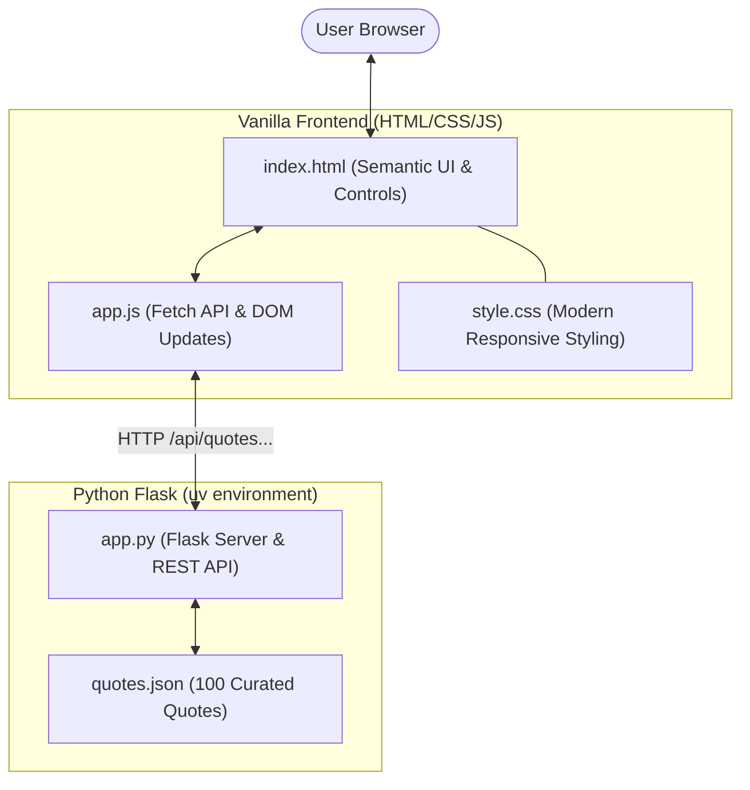

# Implementation Plan: Famous Quotes Web Application

A lightweight, responsive web application built with Python Flask, `uv`, and plain vanilla HTML/CSS/JavaScript to showcase 100 curated famous quotes with random quote generation, author and category filtering, and instant search.



---

## User Review Required

> [!IMPORTANT]
> **Tooling Confirmation (`uv`)**: We will initialize the project using `uv` inside `/Users/cryptoyorkie/agy-cli-projects/famous-quotes` with a standard `pyproject.toml` and lockfile.
>
> **100 Quotes Dataset**: The dataset will contain 100 diverse, accurately attributed quotes across key categories (Science, Philosophy, Literature, Technology, History, Art, Leadership, Wisdom).

---

## Open Questions

1. **Search Experience**: Would you prefer the search to perform instant filtering as you type in vanilla JS, or trigger on pressing Enter / clicking "Search"? *(Default proposed: Instant responsive debounced search + category dropdown filter)*.
2. **Default Landing View**: Should the initial view prominently feature one large "Quote of the Moment" card with a "Roll Another" button, while offering the search/browse catalog right below or in a tab? *(Default proposed: Hero random quote card at the top + interactive search & filter catalog below)*.

---

## Proposed Changes

### Environment & Dependencies (`uv`)

#### [NEW] `pyproject.toml`
Defines project metadata and dependencies:
- `flask >= 3.0.0`
- `pytest >= 8.0.0` (for automated endpoint testing)

---

### Backend Components

#### [NEW] `quotes.json`
A curated database of exactly 100 quotes formatted as:
```json
[
  {
    "id": 1,
    "quote": "A computer would deserve to be called intelligent if it could deceive a human into believing that it was human.",
    "author": "Alan Turing",
    "category": "Technology"
  },
  ...
]
```

#### [NEW] `app.py`
Flask server implementing both page delivery and REST API endpoints:
- `GET /`: Serves `index.html`.
- `GET /api/quotes/random`: Returns a random quote, optionally filtered by `?category=...`.
- `GET /api/quotes`: Query quotes with parameters `?q=...`, `?author=...`, `?category=...`.
- `GET /api/categories`: Returns list of all unique categories with counts.
- `GET /api/authors`: Returns list of all unique authors with counts.

---

### Frontend Components (Plain Vanilla HTML/CSS/JS)

#### [NEW] `templates/index.html`
Semantic HTML layout featuring:
- Hero banner with "Quote of the Moment" and "New Random Quote" button.
- Filter toolbar: Category selector, author search input, and clear button.
- Results gallery: Dynamic card list showing matched quotes, tags, and copy buttons.

#### [NEW] `static/css/style.css`
Modern styling:
- Elegant typography (system font stack with clean serif accents for quotes).
- Responsive card grid and flexbox controls.
- Smooth transitions for quote swapping and card animations.
- Dark/light system theme adaptive styling.

#### [NEW] `static/js/app.js`
Vanilla JavaScript (no frameworks or libraries):
- `fetchRandomQuote(category)`: Fetches and displays a random quote with smooth DOM animation.
- `searchQuotes(query, category)`: Fetches filtered quotes and renders quote cards.
- `populateFilters()`: Dynamically loads available categories from `/api/categories`.
- `copyToClipboard()`: One-click quote copying with feedback tooltip.

---

### Automated Tests

#### [NEW] `tests/test_app.py`
Pytest test suite:
- Verifies exactly 100 valid quotes are loaded without duplicate IDs or empty fields.
- Tests `GET /api/quotes/random` endpoint and category filtering.
- Tests `GET /api/quotes` search matching by author substring, keyword, and category.
- Tests `GET /api/categories` and `GET /api/authors` responses.

---

## Verification Plan

### Automated Tests
Execute using `uv run pytest`:
```bash
uv run pytest tests/test_app.py -v
```

### Manual Verification
1. Launch the server:
   ```bash
   uv run flask --app app run --port 5000
   ```
2. Open `http://localhost:5000` in the browser.
3. Test features:
   - Click "New Random Quote" repeatedly to verify random quote rendering.
   - Filter by a category (e.g. "Philosophy") and verify quotes match.
   - Search by author (e.g. "Albert Einstein" or "Turing") and verify instant search results.
   - Test "Copy Quote" button and check clipboard contents.
